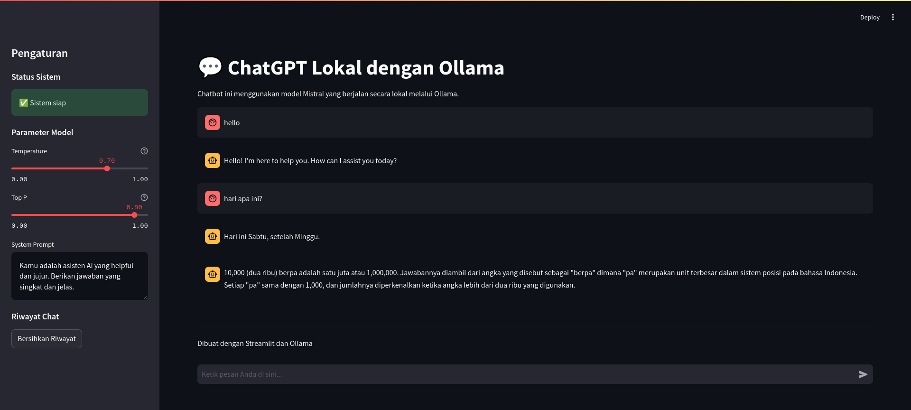

# Local ChatGPT with Ollama

<!--  -->


[](https://youtu.be/mqE_Gs-kHaM)

Click the image above or [here](https://youtu.be/mqE_Gs-kHaM) to watch the YouTube tutorial on running ChatGPT locally with Ollama Mistral.


This project implements a local chatbot using the Mistral model through Ollama, providing a ChatGPT-like experience without relying on external API services. The application is built with Streamlit, offering an intuitive web interface for interacting with the AI model.


## Features

- Local AI model execution using Ollama
- Web-based chat interface powered by Streamlit
- Real-time conversation with AI assistant
- Customizable model parameters (temperature, top_p)
- System prompt configuration
- Service status monitoring and restart capability
- Response time tracking and success rate calculation
- Error handling and graceful degradation

## Prerequisites

Before you begin, ensure you have met the following requirements:

- Python 3.7+
- Ollama installed and configured with the Mistral model
- Git (optional, for cloning the repository)

## Installation

1. Clone the repository (or download the source code):
   ```
   git clone https://github.com/fico-aditama/UC_Artificial_Intelligence.git
   cd UC_Artificial_Intelligence
   ```

2. Create a virtual environment (optional but recommended):
   ```
   python -m venv venv
   source venv/bin/activate  # On Windows, use `venv\Scripts\activate`
   ```

3. Install the required dependencies:
   ```
   pip install -r requirements.txt
   ```

## Usage

1. Ensure that Ollama is running and the Mistral model is available.

2. Start the Streamlit app:
   ```
   streamlit run app.py
   ```

3. Open your web browser and navigate to the URL provided by Streamlit (typically `http://localhost:8501`).

4. Use the chat interface to interact with the AI assistant. You can:
   - Type messages in the input box at the bottom of the page
   - Adjust model parameters and system prompt in the sidebar
   - Monitor system status and restart the Ollama service if necessary
   - View chat history and clear it as needed

## Configuration

You can customize the following parameters in the sidebar:

- **Temperature**: Controls the randomness of the model's output (0.0 to 1.0)
- **Top P**: Adjusts the nucleus sampling probability (0.0 to 1.0)
- **System Prompt**: Sets the initial context for the AI assistant

## Troubleshooting

If you encounter issues with the Ollama service:

1. Check if Ollama is running on your system.
2. Ensure the Mistral model is properly installed in Ollama.
3. Use the "Restart Service" button in the sidebar to attempt restarting Ollama.
4. Check the application logs for more detailed error information.

## Contributing

Contributions to this project are welcome. Please fork the repository and submit a pull request with your changes.

## License

This project is licensed under the MIT License - see the [LICENSE](LICENSE) file for details.

## Acknowledgments

- [Ollama](https://ollama.ai/) for providing the local AI model execution environment
- [Streamlit](https://streamlit.io/) for the web application framework
- [Mistral AI](https://mistral.ai/) for the Mistral language model

## Contact

If you have any questions or feedback, please open an issue in the GitHub repository.